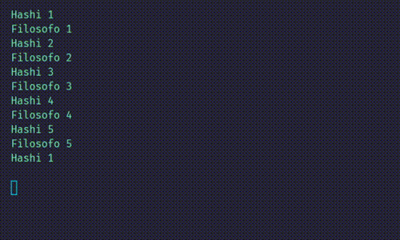
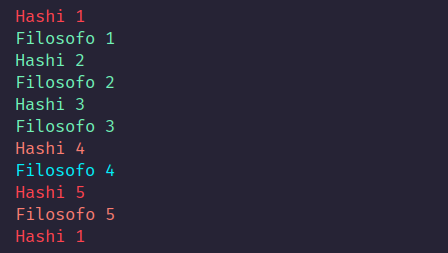

# Ceia de filósofos
Problema dos Filósofos comensais/Ceia de filósofos (dining philosophers) desenvolvido em golang.  
\
  
\
\
Nesse próximo exemplo  
O filósofo 5 está comendo usando os hashi 5 e 1  
O filósofo 4 está esperando o hashi 5 ficar disponível
O hashi 4 foi reservado pelo filósofo 4  
\
  
